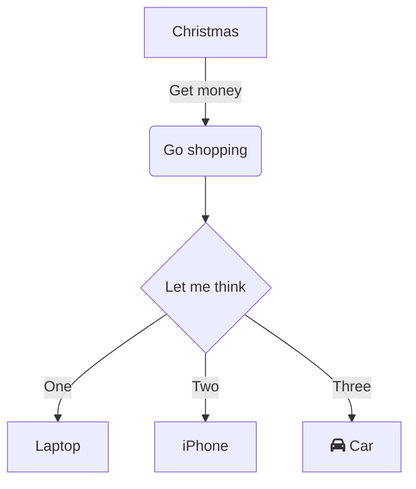

## Linking Your Thinking (YouTube channel)

That escalated quickly.

> It's really about who you are, and who you want to be.
>
> When I approach something that I will be spending countless hours with, like a tool for knowledge management, a low, rumbling question is just always present:
> 
> How is this shaping me?
> 
> And do I like what I'm becoming?
> 
> Because while it's true that we shape our tools, it's equally true, and more profound, that our tools shape us.
> 
> So let's explore how personal knowledge management tools like Obsidian and Roam are shaping us. And why I believe Obsidian will overtake Roam.

<iframe width="560" height="315" src="https://www.youtube.com/embed/_x54XJrECvk?start=7" title="YouTube video player" frameborder="0" allow="accelerometer; autoplay; clipboard-write; encrypted-media; gyroscope; picture-in-picture" allowfullscreen></iframe>

---

## 100 OBSIDIAN TIPS: Beginner to Advanced in 24 Minutes | Obsidian Tutorial
https://www.youtube.com/watch?v=wKNWMBeGCuU
### Query blocks
https://www.youtube.com/watch?v=wKNWMBeGCuU&t=18m37s
```query
tag: test
```

### diagrams / charts
https://mermaid-js.github.io/mermaid-live-editor/


### block reference
https://www.youtube.com/watch?v=wKNWMBeGCuU&t=17m40s
[[Obsidian.md#^block-e67fba]]

a block (separated by empty lines) ^block-e67fba

### placeholder
aoeu\
snth

### footnote
[^1][^fn2] (needs at least 1 empty line after this)
 
[^1]: footnote 1
[^fn2]: footnote 2
